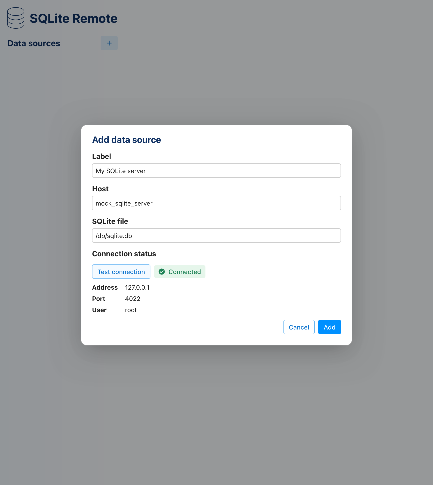
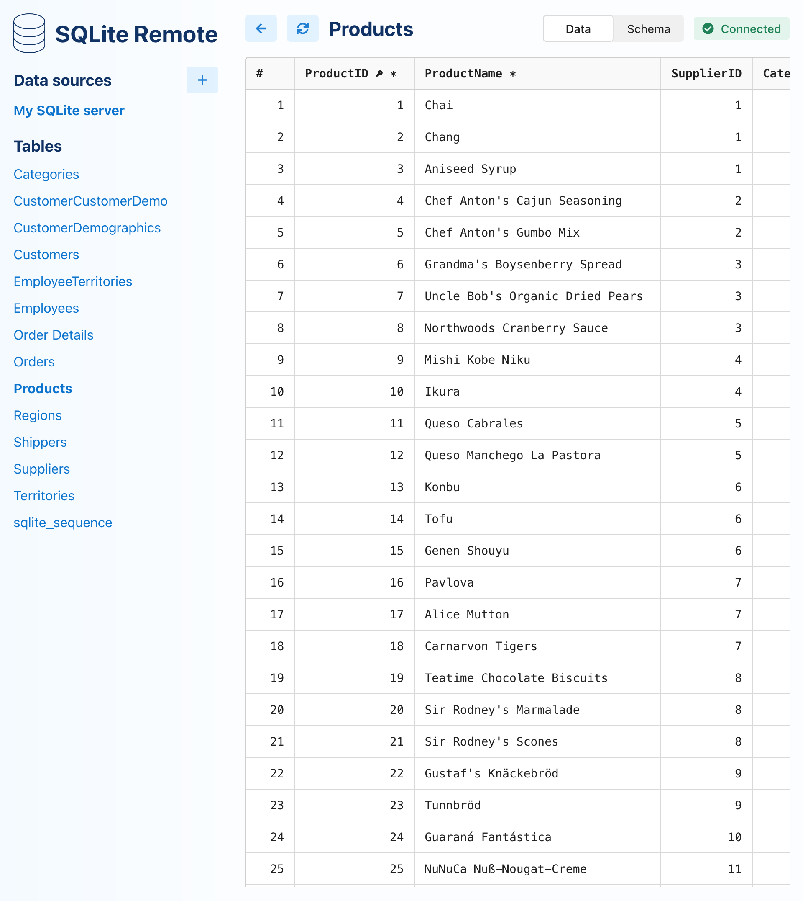
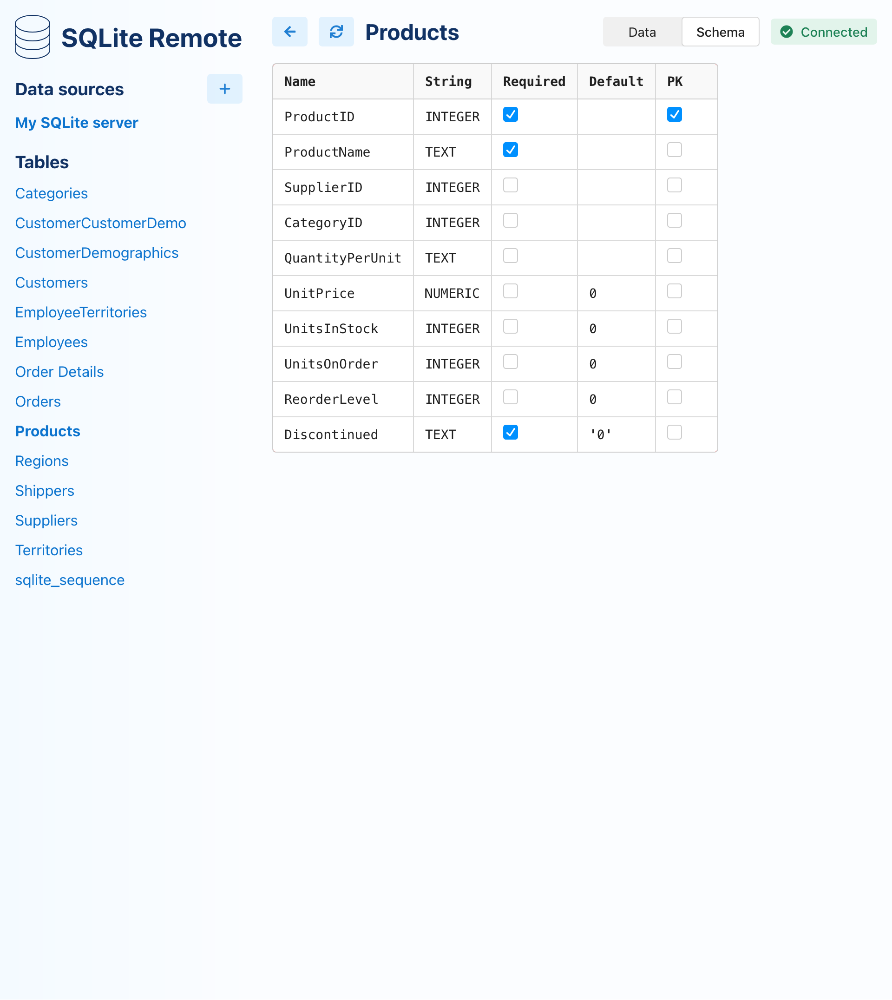

# SQLite Remote

Remotely access your SQLite database over SSH.

## Context

SQLite databases can be used for various purposes, including providing persistent storage for web applications and APIs.
However, SQLite is not designed to be accessed remotely.

This project aims to solve this problem. By accessing the SQLite database over SSH, using the SQLite binary on the
remote host, communication to the SQLite database occurs without any network latency.
This eliminates risks of data corruption that might occur when SQLite databases are accessed over the network.

No software installation is required on the remote host - only the `sqlite3` binary and an SSH server!

## Platform support

### Client

#### OS

| Platform       | Status     | Notes                           |
|----------------|------------|---------------------------------|
| macOS          | Supported  |                                 |
| Linux (Ubuntu) | Unknown    | Expected to work, needs testing |
| Linux (other)  | Unknown    | Expected to work, needs testing |
| Windows        | Won't work | Not planned as of now           |

#### Browser support

| Browser | Status    |
|---------|-----------|
| Chrome  | Supported |
| Firefox | Supported |
| Safari  | Supported |

### Server

| Platform             | Status     | Notes                                         |
|----------------------|------------|-----------------------------------------------|
| Linux (Ubuntu 22.04) | Verified   | Tested on Raspberry PI                        | 
| Linux (Alpine 3.22)  | Verified   | Tested on [Docker Mock server](./mock-server) | 
| Linux (other)        | Unknown    | Expected to work, needs testing               |
| macOS                | Unknown    | Expected to work, needs testing               |
| Windows              | Won't work | Not planned as of now                         |

## Features

### Connect to data source



### View data



### View schema



## Installation

The app can't be installed directly yet. Docker Compose support is coming soon.

## Getting started

A data source needs to be specified in your SSH config file (`~/.ssh/config`). An example for the [Alpine 3.22 mock server](mock-server/alpine-3_22) can be found below:

```
Host sqlite_alpine_3_22
    HostName 127.0.0.1
    User root
    Port 4022
    IdentityFile ~/.ssh/id_sqlite_remote
    StrictHostKeyChecking no
```

Refer to the following README files:
 
- [backend](./backend) 
- [frontend](./frontend) 
- [mock server](./mock-server) (if you want to run a local test server)

### SSH authentication methods

| Method                  | Planned | Supported | Notes           |
|-------------------------|---------|-----------|-----------------|
| SSH key                 | Yes     | Yes       | Recommended     |
| SSH key with passphrase | Yes     | No        | Recommended     |  
| Password                | Yes     | No        | Not recommended |    

### SSH config fields

The following SSH config fields of a host entry are currently parsed and supported by the application:

* HostName (optional, defaults to name of host entry)
* User (required)
* Port (optional, defaults to 22)
* IdentityFile (required)

## Components

* [Backend](./backend): .NET REST API which accesses the SQLite database over SSH
* [Frontend](./frontend): React user interface
* [Mock server](./mock-server): a Docker compse stack which contains a SQLite database and an SSH server, for local testing
