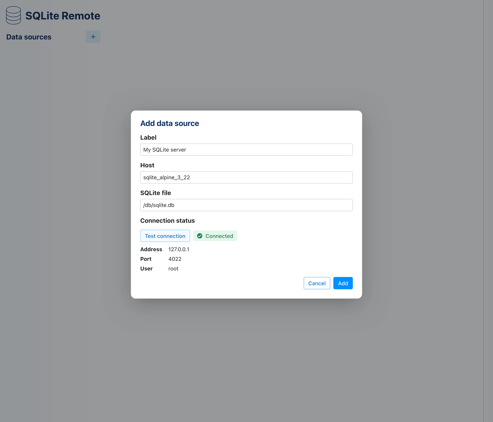
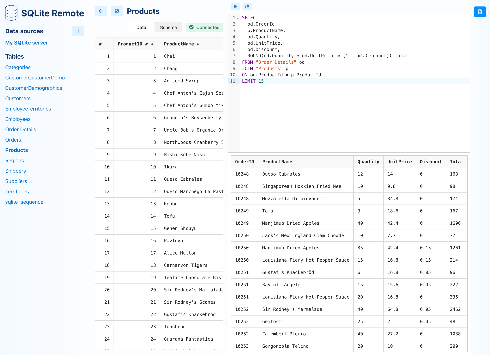
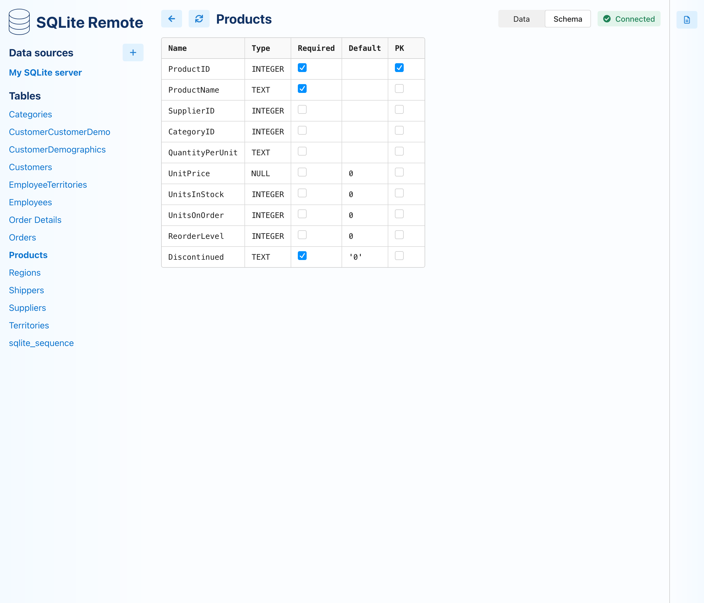

# SQLite Remote

Remotely access your SQLite database over SSH.

## Context

SQLite databases can be used for various purposes, including providing persistent storage for web applications and APIs.
However, SQLite is not designed to be accessed remotely.

This project aims to solve this problem. By accessing the SQLite database over SSH, using the SQLite binary on the
remote host, communication to the SQLite database occurs without any network latency.
This eliminates risks of data corruption that might occur when SQLite databases are accessed over the network.

No software installation is required on the remote host - only the `sqlite3` binary and an SSH server!

## Installation

The application can be run using Docker Compose. After starting, open [localhost:4444](http://localhost:4444) to access the application.

(i) Important: 

Add your SSH identity file to your SSH agent, otherwise the application can't access them when running in Docker. Example: `ssh-add ~/.ssh/id_sqlite_remote`

```shell
git clone https://github.com/OlivierBouchoms/sqlite-remote.git
cd sqlite-remote
docker compose up -d
```

## Features

### Connect to data source



### Data display and query console



### View schema



## Getting started

A data source needs to be specified in your SSH config file (`~/.ssh/config`). An example for the [Alpine 3.22 mock server](mock-server/alpine-3_22) can be found below:

```
Host sqlite_alpine_3_22
    HostName 127.0.0.1
    User root
    Port 4022
    IdentityFile ~/.ssh/id_sqlite_remote
    StrictHostKeyChecking no
```

Refer to the following README files:
 
- [backend](./backend) 
- [frontend](./frontend) 
- [mock server](./mock-server) (if you want to run a local test server)

### SSH authentication methods

| Method                  | Planned | Supported | Notes           |
|-------------------------|---------|-----------|-----------------|
| SSH key                 | Yes     | Yes       | Recommended     |
| SSH key with passphrase | Yes     | No        | Recommended     |  
| Password                | Yes     | No        | Not recommended |    

### SSH config fields

The following SSH config fields of a host entry are currently parsed and supported by the application:

* HostName (optional, defaults to name of host entry)
* User (required)
* Port (optional, defaults to 22)
* IdentityFile (required)

## Components

* [Backend](./backend): .NET REST API which accesses the SQLite database over SSH
* [Frontend](./frontend): React user interface
* [Mock server](./mock-server): a Docker compose stack which contains a SQLite database and an SSH server, for local testing

## Platform support

### Local machine

The local machine runs the SQLite Remote API and frontend client application.

#### OS

| Platform       | Status     | Notes                                |
|----------------|------------|--------------------------------------|
| macOS          | Supported  | Tested on dev machine                |
| Linux (Ubuntu) | Supported  | Tested on Ubuntu VMs (22.04 & 24.04) |
| Linux (other)  | Unknown    | Expected to work                     |
| Windows        | Unknown    |                                      |

#### Browser support

| Browser | Status    |
|---------|-----------|
| Chrome  | Supported |
| Firefox | Supported |
| Safari  | Supported |

### Remote server

The remote server hosts the actual SQLite database file.

| Platform             | Status     | Notes                           |
|----------------------|------------|---------------------------------|
| Linux (Alpine 3.22)  | Verified   | Tested using Docker Mock server | 
| Linux (Alpine 3.23)  | Verified   | Tested using Docker Mock server | 
| Linux (Ubuntu 22.04) | Verified   | Tested using Docker mock server | 
| Linux (Ubuntu 24.04) | Verified   | Tested using Docker mock server | 
| Linux (other)        | Unknown    | Expected to work                |
| Windows              | Unknown    |                                 |
